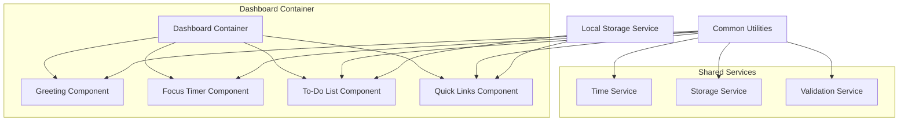
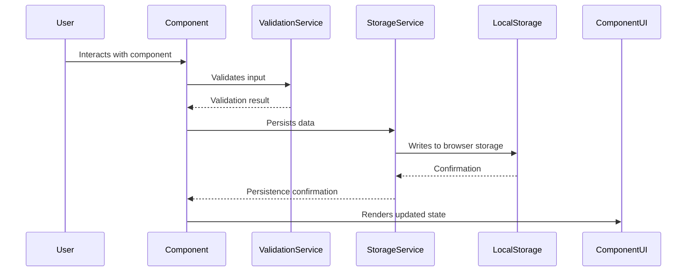

# Design Document: To-Do List Life Dashboard

## Overview

The To-Do List Life Dashboard is a standalone web application designed to boost daily productivity through four integrated components: a greeting display with time and date, a 25-minute focus timer for Pomodoro-style work sessions, a fully functional to-do list with CRUD operations, and a quick links manager for frequently visited websites. The application operates entirely in the browser using Vanilla JavaScript and the browser's Local Storage API for data persistence, requiring no backend server, build tools, or external dependencies.

### Design Philosophy

The design follows three core principles: simplicity, reliability, and user experience. Simplicity is achieved through Vanilla JavaScript without frameworks, minimizing the learning curve and eliminating build complexity. Reliability comes from comprehensive validation, defensive error handling, and data persistence that protects user work. User experience is prioritized through responsive design, clear visual hierarchy, and immediate feedback for all interactions.

### Technology Stack

The application uses plain HTML5, CSS3, and ES6+ JavaScript without any external libraries or frameworks. This approach ensures fast load times (under 2 seconds on broadband), zero setup requirements, and easy maintainability. The application leverages standard Web APIs including the Web Storage API for persistence, the Audio API for alerts, and the Fetch API for favicon retrieval. Browser compatibility targets Chrome 90+, Firefox 88+, Edge 90+, and Safari 14+ with graceful degradation for older browsers.

## Architecture

### High-Level Component Structure

The application follows a component-based architecture where each of the four main features operates as an independent module with well-defined interfaces. These modules share common utilities for Local Storage operations, time management, and DOM manipulation. The architecture separates concerns cleanly: components handle their own UI rendering and user interactions, while services manage data persistence and cross-cutting concerns like error handling.



### Data Flow Between Components

Data flows unidirectionally within each component, with user actions triggering updates that flow through validation, persistence, and finally UI rendering. Components do not share state directly; instead, they retrieve and persist data through the Storage Service. This pattern ensures predictable behavior and makes debugging straightforward.



### Local Storage Integration Pattern

All components use a consistent pattern for data persistence. The Storage Service provides a uniform interface with methods for reading, writing, and removing data, abstracting the underlying Local Storage API details. Each component retrieves its data on initialization, subscribes to storage changes if needed, and writes changes immediately after successful mutations. This pattern ensures data consistency and enables future extensibility if additional persistence mechanisms are needed.

The application uses two distinct storage keys: `todoLifeDashboardTasks` for to-do list data and `todoLifeDashboardQuickLinks` for quick links data. Separating these keys allows independent access patterns and simplifies potential migration scenarios. All storage operations are wrapped in try-catch blocks to handle quota exceeded errors and data corruption gracefully.

## Components and Interfaces

### Greeting Component

The Greeting Component displays the current time, date, and a time-appropriate greeting message. It operates as a display-only component that updates based on the system clock without user interaction. The component's design prioritizes readability and immediate visibility when the dashboard loads.

#### Component Structure

The Greeting Component consists of three display elements: a time display showing hours, minutes, and seconds with AM/PM indicator, a date display showing the full day name, month name, day number, and year, and a greeting display showing one of four messages based on the time of day. These elements are wrapped in a container that establishes visual hierarchy within the dashboard.

#### Time and Date Formatting

The component uses dedicated formatting functions that parse JavaScript Date objects into the required display formats. The time formatter converts the current time to 12-hour format with AM/PM suffix, zero-padded hours. The date formatter produces the full day name (Monday through Sunday), full month name (January through December), numeric day with ordinal suffix, and four-digit year. Both formatters handle edge cases like month boundaries and leap years through JavaScript's built-in Date handling.

#### Update Strategy

The time display updates every second using `setInterval` with a 1000-millisecond interval. The date display checks for day boundaries and updates silently when the calendar date changes. This dual-update strategy minimizes unnecessary DOM operations while ensuring accurate information at all times. The component provides an initialization method that renders the current time and date within 500 milliseconds of being called, satisfying the performance requirement.

### Focus Timer Component

The Focus Timer implements a 25-minute countdown timer with full control capabilities. It follows the Pomodoro technique's core timing while providing user controls for managing work sessions. The component maintains internal state for the timer value, running status, and notification visibility.

#### Timer State Management

The component tracks three pieces of state: the remaining time in seconds (initially 1500), a boolean indicating whether the timer is running, and a boolean indicating whether the completion notification is visible. State transitions occur only through defined methods, ensuring predictable behavior and enabling testing of all possible states.

#### Timer Display and Controls

The timer display shows remaining time in MM:SS format with leading zeros for values less than 10. The display updates every second while running, with timing accuracy verified through reference comparisons. The control buttons adapt their labels and behaviors based on the current state: Start initiates counting down and changes to Pause, Pause stops counting down and changes to Resume, Resume continues counting down and changes back to Pause, and Reset returns the timer to 25:00 regardless of current state.

#### Completion Notification

When the timer reaches 00:00, the component triggers both an audible alert and a visual notification. The audio alert uses the Web Audio API to play a 2-second tone. The visual notification overlays the timer display with "Session Complete" text and a dismiss button. Clicking dismiss clears the notification, resets the timer to 25:00, and returns the component to its initial state.

#### Interface Methods

The component exposes methods for programmatic control: `start()` begins the countdown, `pause()` stops the countdown, `resume()` continues the countdown, `reset()` returns to initial state, `setDuration(minutes)` allows configuration of the timer duration, and `getRemainingTime()` returns the current remaining time in seconds.

### To-Do List Component

The To-Do List provides complete task management with Create, Read, Update, and Delete operations. Tasks are stored in Local Storage with immediate persistence on every change. The component supports inline editing for efficient workflow and provides clear visual feedback for all operations.

#### Task Data Structure

Each task contains a unique identifier (UUID generated on creation), the task description text, a boolean indicating completion status, a timestamp recording when the task was created, and a timestamp recording the last modification time. The unique identifier supports reliable updates and deletions even when descriptions change or duplicate descriptions exist.

#### User Interface Elements

The task list displays tasks in the order they were created, with newer tasks appearing at the top. Each task row contains a completion checkbox that toggles the task's completion status, the task description which becomes editable when clicked on incomplete tasks, and a delete button that removes the task from the list. The input area at the top of the list contains a text input field for new task descriptions and an add button for submission.

#### Inline Editing Flow

Clicking an incomplete task's description transforms the display text into an editable input field pre-populated with the current description. The editing state supports two completion methods: pressing Enter or clicking away (blur event) both attempt to save the changes. Validation runs before save, restoring the previous value if validation fails. The edit input also displays a cancel button for abandoning changes.

#### Input Validation

Task descriptions must be between 1 and 100 characters after trimming whitespace. Empty or whitespace-only input is rejected with visual feedback showing an invalid state on the input field. The same validation applies to new task creation and inline editing, ensuring consistent behavior throughout the component.

#### Persistence and Recovery

All task changes (creation, editing, completion toggling, deletion) immediately trigger Local Storage persistence. On load, the component attempts to parse stored JSON data. If parsing fails due to corruption, the component clears the corrupted data, notifies the user, and starts with an empty task list. Storage quota exceeded errors display a notification explaining that changes could not be saved.

### Quick Links Component

The Quick Links component allows users to save, organize, and access frequently visited websites. Each link displays a favicon for quick visual recognition and opens in a new browser tab when clicked. The component supports inline editing for updating link details and validates all input before persistence.

#### Link Data Structure

Each quick link contains a unique identifier (UUID), the link name (1-100 characters), the URL (1-2048 characters, validated as proper URL format), a favicon URL derived from the link's domain, a timestamp recording when the link was created, and a timestamp recording the last modification time.

#### Link Display and Favicons

Saved links display in the order they were added, with each row showing the favicon or a default letter avatar, the link name, and action buttons for edit and delete. Favicon retrieval uses the Google S2 favicon service as a reliable cross-domain favicon source: `https://www.google.com/s2/favicons?domain={hostname}&sz=32`. If favicon retrieval fails (network error, CORS restrictions, or broken image), the display falls back to a default letter avatar showing the first character of the link name.

#### Add New Link Flow

The add link section contains two input fields (name and URL), an add button, and clear validation state. Clicking add validates both inputs: name must be 1-100 non-whitespace characters, URL must be 1-2048 characters and pass URL constructor validation, and the URL must not duplicate an existing link's URL. Validation failures show red borders and error messages on the specific invalid fields. Successful validation creates the link, persists to Local Storage, and clears the input fields.

#### Inline Editing Flow

Clicking the edit button transforms the link row into edit mode, replacing the display with two input fields pre-populated with current values, a save button, and a cancel button. Validation on save follows the same rules as adding a new link. Clicking cancel discards any changes and returns the display to read mode. The inline edit form validates input length and URL format, displaying appropriate error indicators on invalid fields.

#### URL Validation Details

URL validation uses the browser's native URL constructor: `new URL(input)` must not throw an exception. This validates that the input is a properly formatted URL with a supported protocol (http, https, mailto, etc.). Relative URLs and malformed strings are rejected. The validation displays a red border and error message text on the URL field when validation fails.

## Data Models

### Task Data Model

```typescript
interface Task {
    id: string;              // UUID v4 generated on creation
    description: string;     // 1-100 characters after trimming
    completed: boolean;      // false initially, toggled by checkbox
    createdAt: number;       // Unix timestamp in milliseconds
    updatedAt: number;       // Unix timestamp, updated on any modification
}

interface TaskList {
    version: number;         // Schema version for future migrations
    tasks: Task[];           // Array of task objects
    lastModified: number;    // Timestamp of last modification
}
```

### Quick Link Data Model

```typescript
interface QuickLink {
    id: string;              // UUID v4 generated on creation
    name: string;            // 1-100 characters, user-provided label
    url: string;             // 1-2048 characters, valid URL format
    faviconUrl: string;      // Computed from domain, may be null
    createdAt: number;       // Unix timestamp in milliseconds
    updatedAt: number;       // Unix timestamp, updated on any modification
}

interface QuickLinkList {
    version: number;         // Schema version for future migrations
    links: QuickLink[];      // Array of link objects
    lastModified: number;    // Timestamp of last modification
}
```

### Local Storage Schema

The application uses two keys in Local Storage with distinct data structures.

**Storage Key: `todoLifeDashboardTasks`**

```json
{
    "version": 1,
    "tasks": [
        {
            "id": "550e8400-e29b-41d4-a716-446655440000",
            "description": "Complete project proposal",
            "completed": false,
            "createdAt": 1705312800000,
            "updatedAt": 1705312800000
        }
    ],
    "lastModified": 1705312800000
}
```

**Storage Key: `todoLifeDashboardQuickLinks`**

```json
{
    "version": 1,
    "links": [
        {
            "id": "550e8400-e29b-41d4-a716-446655440001",
            "name": "GitHub",
            "url": "https://github.com",
            "faviconUrl": "https://www.google.com/s2/favicons?domain=github.com&sz=32",
            "createdAt": 1705312800000,
            "updatedAt": 1705312800000
        }
    ],
    "lastModified": 1705312800000
}
```

### Validation Rules Summary

| Field | Min Length | Max Length | Validation Rules |
|-------|------------|------------|------------------|
| Task Description | 1 | 100 | Trimmed length ≥ 1, no HTML/script injection |
| Link Name | 1 | 100 | Trimmed length ≥ 1, no HTML/script injection |
| Link URL | 1 | 2048 | Valid URL constructor, no duplicate URLs |
| Created At | - | - | Unix timestamp, auto-generated |
| Updated At | - | - | Unix timestamp, auto-updated |

## Correctness Properties

*A property is a characteristic or behavior that should hold true across all valid executions of a system—essentially, a formal statement about what the system should do. Properties serve as the bridge between human-readable specifications and machine-verifiable correctness guarantees.*

### Property 1: Greeting Time-Based Display

**For any** valid Date object representing the local time, the greeting component SHALL display the correct greeting based on the time of day.

- Between 05:00:00 and 11:59:59: displays "Good Morning"
- Between 12:00:00 and 16:59:59: displays "Good Afternoon"
- Between 17:00:00 and 20:59:59: displays "Good Evening"
- Between 21:00:00 and 04:59:59: displays "Good Night"

**Validates: Requirements 1.3, 1.4, 1.5, 1.6**

### Property 2: Time Format Consistency

**For any** valid Date object, the time formatter SHALL produce a string in "HH:MM:SS AM/PM" format where HH is a zero-padded number from 01 to 12.

**Validates: Requirements 1.1**

### Property 3: Date Format Consistency

**For any** valid Date object, the date formatter SHALL produce a string in "EEEE, MMMM d, yyyy" format with the full day name, full month name, day number without leading zeros, and four-digit year.

**Validates: Requirements 1.2**

### Property 4: Task Persistence Round-Trip

**For any** valid task object, serializing it to JSON and parsing it back SHALL produce an equivalent task object with identical id, description, completed status, createdAt, and updatedAt values.

**Validates: Requirements 3.10, 3.11**

### Property 5: Task Addition Validation

**For any** string input, the task validator SHALL accept the input if and only if the trimmed string has length between 1 and 100 characters inclusive.

**Validates: Requirements 3.1, 3.2**

### Property 6: Task List Order Preservation

**For any** initial task list and any sequence of task additions, the new task SHALL be appended to the end of the task list maintaining the relative order of all existing tasks.

**Validates: Requirements 3.14**

### Property 7: Quick Link URL Validation

**For any** string input, the URL validator SHALL accept the input if and only if `new URL(input)` does not throw an exception.

**Validates: Requirements 4.11**

### Property 8: Quick Link Uniqueness

**For any** existing quick link list and any new valid quick link, the URL uniqueness validator SHALL reject the new link if its URL exactly matches any existing link's URL.

**Validates: Requirements 4.1**

### Property 9: Quick Link Persistence Round-Trip

**For any** valid quick link object, serializing it to JSON and parsing it back SHALL produce an equivalent quick link object with identical id, name, url, faviconUrl, createdAt, and updatedAt values.

**Validates: Requirements 4.8, 4.9**

### Property 10: Timer Duration Accuracy

**For any** timer initialized to 25 minutes (1500 seconds), **for all** 100 consecutive one-second intervals during a running timer, the displayed remaining time SHALL decrease by exactly 1 second with maximum deviation of 100 milliseconds from the expected wall-clock time.

**Validates: Requirements 2.12**

### Property 11: Timer State Transitions

**For any** initial timer state (25:00, not running), the sequence Start → Pause → Resume → Reset SHALL return the timer to its initial state (25:00, not running) with each transition completing within the specified maximum time (500ms for start/resume, 1s for pause, 500ms for reset).

**Validates: Requirements 2.3, 2.5, 2.7, 2.8**

## Error Handling

### Storage Errors

The application handles several categories of storage errors with appropriate user feedback.

**Quota Exceeded**: When Local Storage reaches its limit (typically 5-10MB), write operations throw a QuotaExceededError. The application catches this error, displays a notification explaining that storage is full, and allows the user to continue using the application with in-memory data only. The notification provides options to delete existing data or retry the operation.

**Data Corruption**: On load, if stored JSON cannot be parsed, the application treats this as data corruption. It clears the corrupted data, displays a notification explaining that saved data could not be recovered, and initializes with empty data structures. The notification is dismissible, allowing the user to continue with a fresh session.

**Storage Unavailable**: In private browsing modes or if cookies are blocked, Local Storage may be unavailable. The application detects this by testing a write operation on initialization. If storage is unavailable, the application operates in memory-only mode and displays a persistent notification explaining that data will not persist between sessions.

### Validation Errors

Validation errors provide immediate visual feedback to users without disrupting workflow.

**Task Validation Failures**: Invalid task input (empty, too long) highlights the input field with a red border and displays an error message below the field. The add button remains functional, allowing the user to correct the input. The invalid state clears when the user starts typing again.

**Quick Link Validation Failures**: Invalid URL input shows a red border on the URL field with the error message "Please enter a valid URL". Invalid name input shows a red border on the name field with the error message "Name must be between 1 and 100 characters". Duplicate URL prevents addition and shows "A link with this URL already exists". All validation errors clear when the user modifies the field.

### Timer Errors

**Timer Accuracy Degradation**: If the timer detects significant drift (more than 500ms deviation over 10 seconds), it recalibrates by comparing the expected remaining time against the actual elapsed wall-clock time and adjusts the internal tick rate to maintain accuracy.

**Audio Playback Failure**: If the audio alert cannot play (due to browser autoplay policies or missing audio context), the application falls back to an increased-duration visual notification with pulsing animation to ensure the user still receives completion feedback.

### Component Initialization Errors

If any component fails to initialize (DOM elements missing, invalid configuration), the application logs the error to console, displays a user-friendly error message in the component's location, and continues initializing other components. This isolation prevents a single component failure from bringing down the entire dashboard.

## Testing Strategy

### Unit Testing Approach

Unit tests verify individual functions and small units of behavior using example-based tests for specific scenarios and property-based tests for universal behaviors.

**Greeting Component Tests**: Example-based tests verify correct output for specific dates and times (midnight, noon, boundary conditions). Property-based tests verify that the greeting logic covers all four time ranges correctly.

**Focus Timer Tests**: Example-based tests verify each control button's effect on timer state. Property-based tests verify timing accuracy across multiple runs with randomly varied start times.

**To-Do List Tests**: Example-based tests cover each CRUD operation with typical inputs. Property-based tests verify validation rules across the full range of valid and invalid inputs. Round-trip tests verify serialization/deserialization preserves data integrity.

**Quick Link Tests**: Example-based tests cover the add/edit/delete workflows with typical URLs and names. Property-based tests verify URL validation rejects all invalid formats and accepts all valid formats.

### Integration Testing Approach

Integration tests verify that components work together correctly through the Storage Service.

**Storage Service Tests**: Tests verify that the storage service correctly reads and writes both task and quick link data, handles concurrent modifications gracefully, and implements proper error handling for quota and corruption scenarios.

**Component-Server Integration Tests**: Tests verify that each component correctly uses the storage service, handles persistence errors appropriately, and initializes correctly from stored data.

**Full Dashboard Integration Test**: A single end-to-end test sequence initializes the dashboard, adds a task, adds a quick link, starts the timer, and verifies all components display correctly. This test runs on each deployment to verify the complete integration works.

### Test Configuration

Each property-based test runs a minimum of 100 iterations with diverse input generation. Tests tag format: `Feature: todo-life-dashboard, Property {number}: {property_text}`. Unit tests use a simple assertion library without external dependencies.

### Test Files Structure

```
tests/
├── unit/
│   ├── greeting.test.js
│   ├── timer.test.js
│   ├── tasks.test.js
│   ├── links.test.js
│   └── validation.test.js
├── integration/
│   ├── storage.test.js
│   └── components.test.js
└── e2e/
    └── dashboard.test.js
```

### Browser Testing Strategy

Tests run in Chrome, Firefox, and Safari through a matrix testing approach. Core functionality tests verify behavior is consistent across browsers. CSS tests verify layout and styling work across responsive breakpoints. Performance tests verify load time is under 2 seconds and interaction response times are under 100 milliseconds.

## User Interface Design

### Layout Structure

The dashboard uses a card-based layout with each component in its own card container. The cards arrange vertically on mobile devices (320px width) and shift to a two-column grid on medium screens (768px+), with Greeting and Quick Links in the left column and Focus Timer and To-Do List in the right column. On large screens (1200px+), all four components display in a single row with even spacing.

### Visual Hierarchy

The Greeting Component appears at the top with the largest text, establishing the temporal context for the session. The Focus Timer appears below Greeting with prominent time display. The To-Do List occupies the largest area, reflecting its primary role in task management. Quick Links appears as a compact sidebar element for quick access.

Each component uses consistent styling: a white or light-colored card background with subtle shadow, a header section with the component title, a content area for the component's specific functionality, and consistent button styling with hover and active states.

### Responsive Design Approach

The application uses CSS Grid for the main layout and Flexbox for component internals. Breakpoints are defined at 768px (tablet) and 1200px (desktop). At each breakpoint, components resize proportionally and adjust their internal layouts. The timer display scales its font size based on container width. The task list scrolls vertically when content exceeds the available height. Quick Links wraps to multiple rows when space is constrained.

### Color Scheme

The application uses a calm, neutral color palette designed for extended use:

- **Background**: Off-white (#f8f9fa) reduces eye strain
- **Card Background**: White (#ffffff) with subtle shadow
- **Primary Text**: Dark gray (#2d3436) for readability
- **Secondary Text**: Medium gray (#636e72) for labels and metadata
- **Accent Color**: Soft blue (#74b9ff) for buttons and links
- **Success Color**: Soft green (#55efc4) for completed tasks
- **Error Color**: Soft red (#ff7675) for validation errors
- **Focus Timer**: Warm orange (#fab1a0) for visibility without urgency

All colors pass WCAG AA contrast requirements for accessibility.

### Typography

The application uses a system font stack: `-apple-system, BlinkMacSystemFont, "Segoe UI", Roboto, Helvetica, Arial, sans-serif`. This ensures fast loading (no web font fetch) and native feel on each platform.

Font sizes follow a type scale:
- Large (32px): Timer display
- Medium (24px): Time and greeting
- Body (16px): Task descriptions, link names
- Small (14px): Labels, metadata, validation messages
- Caption (12px): Error messages, timestamps

### Interactive Feedback

All interactive elements provide immediate visual feedback:
- **Buttons**: Background color change on hover, scale transform on active
- **Inputs**: Border color change on focus, red border on validation error
- **Checkboxes**: Color change when checked
- **Links**: Underline on hover
- **Loading States**: Button text changes to "Loading..." during async operations

## User Interface Mockup

```
┌─────────────────────────────────────────────────────────────────────────────┐
│                                                                             │
│    ┌─────────────────────────────────────────────────────────────────┐     │
│    │                                                                 │     │
│    │                     Good Morning                                │     │
│    │                     10:45:32 AM                                 │     │
│    │                 Monday, January 15, 2026                        │     │
│    │                                                                 │     │
│    └─────────────────────────────────────────────────────────────────┘     │
│                                                                             │
│  ┌──────────────────────────┐  ┌────────────────────────────────────────┐   │
│  │   FOCUS TIMER            │  │   TO-DO LIST                          │   │
│  │                          │  │                                        │   │
│  │        25:00             │  │   [  + Add Task                        │   │
│  │                          │  │   ─────────────────────────────────    │   │
│  │  [Start] [Reset]         │  │   [✓] Complete project proposal       │   │
│  │                          │  │         [✎] [🗑]                       │   │
│  │                          │  │   [✓] Review pull requests            │   │
│  │                          │  │         [✎] [🗑]                       │   │
│  │                          │  │   [✓] Update documentation            │   │
│  │                          │  │         [✎] [🗑]                       │   │
│  │                          │  │                                        │   │
│  └──────────────────────────┘  └────────────────────────────────────────┘   │
│                                                                             │
│  ┌─────────────────────────────────────────────────────────────────────┐   │
│  │   QUICK LINKS                                                        │   │
│  │                                                                      │   │
│  │   [+ Add New Link]                                                  │   │
│  │   Name: [________________]  URL: [______________________]  [Add]     │
│  │                                                                      │   │
│  │   (G) GitHub                      [✎] [🗑]                           │   │
│  │   (S) Stack Overflow              [✎] [🗑]                           │   │
│  │   (D) Documentation               [✎] [🗑]                           │   │
│  │                                                                      │   │
│  └─────────────────────────────────────────────────────────────────────┘   │
│                                                                             │
└─────────────────────────────────────────────────────────────────────────────┘
```

### Layout Explanation

The dashboard centers its content with a maximum width of 1200px on large screens. Each component uses a white card with subtle shadow against the off-white background. The greeting uses the largest text (24px for time, 32px for greeting) to establish immediate context. The timer uses a large monospace font for the countdown display. The to-do list uses a clean layout with clear completion checkboxes, inline edit buttons (pencil icon), and delete buttons (trash icon). Quick links show favicons (G for GitHub, S for Stack Overflow, D for Documentation) or letter avatars for sites without accessible favicons.

All buttons and interactive elements use consistent styling with hover states. The add new link section collapses to a compact form when not in use. Validation errors appear as red borders on invalid fields with text messages below the inputs.

## Technical Implementation Details

### File Structure

```
todo-life-dashboard/
├── index.html          # Main HTML document
├── css/
│   └── style.css       # All styling rules
└── js/
    ├── app.js          # Main application entry point
    ├── greeting.js     # Greeting component module
    ├── timer.js        # Focus timer component module
    ├── tasks.js        # To-do list component module
    ├── links.js        # Quick links component module
    └── utils.js        # Shared utilities (storage, validation, time)
```

### Key Function Signatures

**utils/storage.js**

```javascript
// Storage operations
function getItem(key, defaultValue): any
function setItem(key, value): boolean
function removeItem(key): boolean
function clear(): void
function isAvailable(): boolean
```

**utils/validation.js**

```javascript
// Validation functions
function isValidTaskDescription(text): boolean
function isValidLinkName(text): boolean
function isValidUrl(text): boolean
function isUniqueUrl(text, existingLinks): boolean
function sanitizeInput(text): string  // Remove HTML/script injection
```

**greeting.js**

```javascript
// Greeting component
function initGreeting(containerElement): GreetingController
function updateTime(): void
function updateDate(): void
function getGreeting(): string  // Returns "Good Morning", etc.
```

**timer.js**

```javascript
// Timer component
function initTimer(containerElement): TimerController
function start(): void
function pause(): void
function resume(): void
function reset(): void
function getRemainingSeconds(): number
function onComplete(callback): void
```

**tasks.js**

```javascript
// Task component
function initTasks(containerElement, storageKey): TasksController
function addTask(description): Task
function updateTask(id, description): Task | null
function toggleTask(id): Task | null
function deleteTask(id): boolean
function getAllTasks(): Task[]
function clearAll(): void
```

**links.js**

```javascript
// Quick links component
function initLinks(containerElement, storageKey): LinksController
function addLink(name, url): QuickLink
function updateLink(id, name, url): QuickLink | null
function deleteLink(id): boolean
function getAllLinks(): QuickLink[]
function getFaviconUrl(url): string
function clearAll(): void
```

### Event Handling Patterns

The application uses event delegation for list-based components (tasks and links), attaching a single event listener to each list container rather than individual listeners on each item. This reduces memory usage and simplifies dynamic item handling.

For form inputs, the application uses the `input` event for real-time validation feedback and the `change` event for commit-style validation. The enter key is captured explicitly for form submission, and blur events trigger save operations in inline editing.

Custom events signal important state changes: `task:added`, `task:updated`, `task:deleted`, `task:completed`, `timer:complete`, `link:added`, `link:updated`, `link:deleted`. Components may subscribe to these events for cross-component communication if needed.

### Local Storage Utilities

The storage module provides a simple interface with automatic JSON serialization and error handling:

```javascript
const Storage = {
    get(key) {
        try {
            const item = localStorage.getItem(key);
            return item ? JSON.parse(item) : null;
        } catch (e) {
            console.error(`Error reading ${key}:`, e);
            return null;
        }
    },
    
    set(key, value) {
        try {
            localStorage.setItem(key, JSON.stringify(value));
            return true;
        } catch (e) {
            console.error(`Error writing ${key}:`, e);
            return false;
        }
    }
};
```

All components use this storage pattern, adding their own schema versioning and migration support as the application evolves.